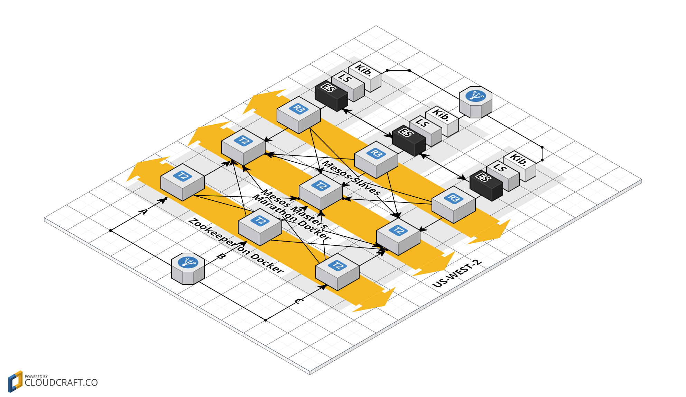

5 Minute BELK Stack
===================
## Proposed Architecture



## Getting Started

First, clone this repository recursively:

`git clone --recursive http://github.com/ryanmaclean/5-min-elk-stack.git`

Next, let's make sure docker-compose is installed:

`pip install docker-compose`

Now we can move to the "docker-elk" folder and run `docker-compose`:

```
cd 5-min-elk-stack/docker-elk
docker-compose up
```

Next, let's add the Beats dashboards:

```
cd ../beats-dashboards
./load.sh -url "http://localhost:9200"
# Change localhost to docker-machine IP on Windows and Mac
```

You can then access Kibana at http://localhost:5601


## Intro
A set of Cloudformation scripts that make it easy to stand up ElasticSearch, Logstash and Kibana with the plan of feeding them metrics via Beats. 

The platform consists of Docker containers running on Mesos AWS EC2 slaves scheduled by Marathon and Chronos. 

Most of the original Cloudformation work and scripts were done by [Mike Babineau](https://github.com/mbabineau). I've forked and created PRs where applicable (just getting stuff up to date after the Docker Hub changes that droppeed support for 1.5).

## Setting Up Your Stack
Start by creating a VPC with internet gateway, one subnet (with 0.0.0.0/0 route to IGW), EC2 key, and one seccurity group that allows 22 (or port of your choice), 2151 and 8181. 

Next, create the first stack using the `zookeeper.json` file:

```
aws cloudformation create-stack --capabilities CAPABILITY_IAM \\
--stack-name FIVEMINELKZOO \\
--template-body file:///home/ec2-user/5-minute-belk-stack/zookeeper.json && \\
watch aws cloudformation describe-stack-events --stack-name FIVEMINELKZOO
```

If you so desire, you can SSH to one of the hosts from your node to check things out:

```
ssh -o "StrictHostKeyChecking no" \\
-i ~/.ssh/YOURFANCY.pem ubuntu@$(aws ec2 describe-instances | \\
grep PrivateIpAddress | cut -d ':' -f 2 | \\
head -1 | tr -d "\," | tr -d "\"" | cut -c 2-)
```

Follow that up by adding `mesos-master.json` and `mesos-slave.json` into your Cloudformation S3 bucket. Take note of the location of both of these as you'll need the for the next step. 

Now run Cloudformation for the `mesos.json` file. 

## Grab the Most Recent Project

`git clone https://github.com/ryanmaclean/5-minute-belk-stack.git`

## Create the Stack

```
aws cloudformation create-stack --capabilities CAPABILITY_IAM --stack-name new2 --template-body file:///home/ec2-user/5-minute-belk-stack/zookeeper.json && 
```

## Check Events

```
aws cloudformation describe-stack-events --stack-name new2
```

## Examine the Stack

```
aws cloudformation describe-stacks --stack-name new2
```

## Delete the Stack
```
aws cloudformation delete-stack --stack-name new2
```

## Watch Stack Events
```
watch aws cloudformation describe-stack-events --stack-name new2
```

## Get the First Private IP from Your New ASG

```
aws ec2 describe-instances | grep PrivateIpAddress | cut -d ':' -f 2 | head -1 | tr -d "\," | tr -d "\"" | cut -c 2-
```

## Get the Cloud Config Run Log

```
more /var/log/cloud-init-output.log
```

ssh -i ~/.ssh/5minelk.pem ubuntu@10.5.5.47

## SSH To One of the New Instances

```
ssh -o "StrictHostKeyChecking no" -i ~/.ssh/5minelk.pem ubuntu@$(aws ec2 describe-instances | grep PrivateIpAddress | cut -d ':' -f 2 | head -1 | tr -d "\," | tr -d "\"" | cut -c 2-)
```

## Delete the S3 Bucket, the Stack and Watch Events

```
aws s3 rm s3://5minelk-zk --recursive && aws cloudformation delete-stack --stack-name new2 && watch aws cloudformation describe-stack-events --stack-name new2
```

## Cfer Tail

### Install Cfer

```
sudo apt-get install ruby-dev rubygems gcc 
gem install io-console cfer
```

### Tail the Cloudformation Process

```
cfer tail --region us-west-2 new2
```

## Set Up Mesos Cloudformation Stack

```
aws cloudformation create-stack --capabilities CAPABILITY_IAM --stack-name mesos --template-body file:///home/ec2-user/5-minute-belk-stack/mesos.json &&  watch aws cloudformation describe-stack-events --stack-name mesos
```

## Delete the Mesos Stack

```
aws cloudformation delete-stack --stack-name mesos && watch aws cloudformation describe-stack-events --stack-name mesos
```
